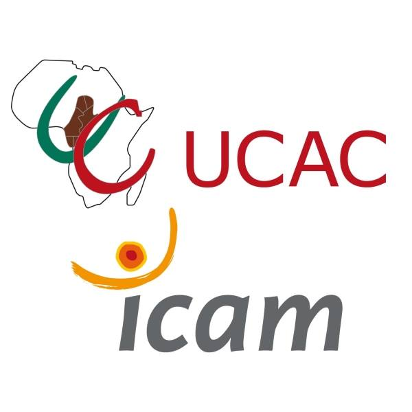

# MyIUI



Online application platform for UCAC-ICAM entrance exam 
made with Node.js, HTML, CSS, Bootstrap and using a MongoDB database

## Getting Started

```
npm install
npm start
```

## The App


